# Лабораторная работа №2

# Цель работы

## Научиться устанавливать WordPress в локальной среде, осваивать админ-панель, изменять внешний вид сайта через темы и расширять его функциональность с помощью плагинов.

# Шаг 1. Подготовка среды

Для выполнения лабораторной работы был установлен локальный сервер **XAMPP**, который включает:

- Apache (веб-сервер)
- MySQL (система управления базами данных)

После установки были запущены модули:

```
Apache
MySQL
```

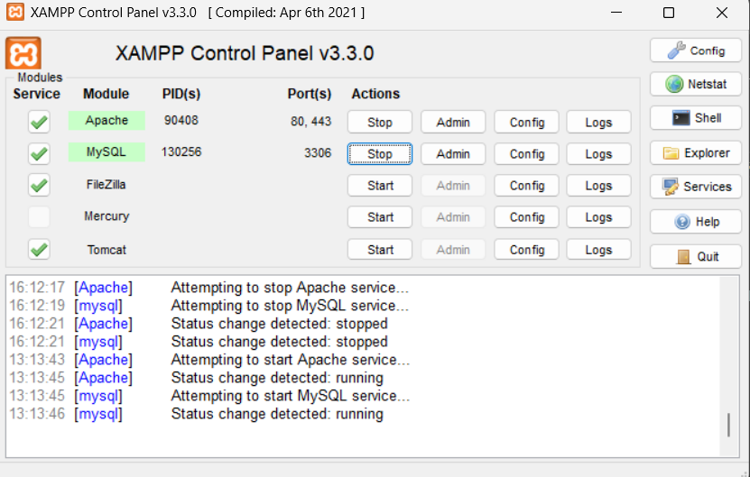

Далее была проверена работа локального сервера:

```
http://localhost
```

После этого через **phpMyAdmin** была создана база данных:

```
wp_lab2
```

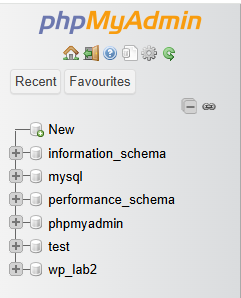

# Шаг 2. Установка WordPress

WordPress был скачан с официального сайта:

```
https://wordpress.org
```

После скачивания архив был распакован в папку:

```
xampp/htdocs/wp_lab2
```

В браузере был открыт адрес:

```
http://localhost/wp_lab2
```

Затем был выполнен процесс установки WordPress:

- указана база данных
- создан администратор
- задано название сайта

После установки стала доступна **административная панель WordPress**.

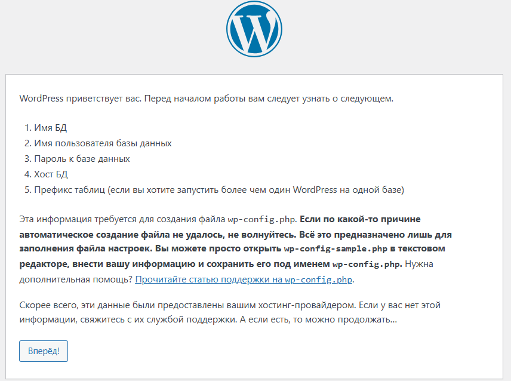
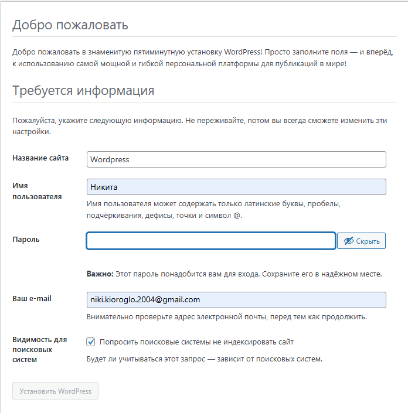

# Шаг 3. Первоначальные настройки сайта

После установки были выполнены базовые настройки сайта.

В разделе:

```
Settings → General
```

были изменены:

- название сайта
- часовой пояс
  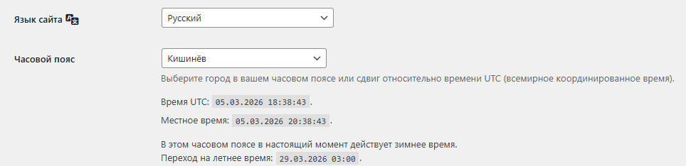

Затем в разделе:

```
Settings → Permalinks
```

был выбран вариант:

```
Post name
```

Это позволяет формировать удобные ссылки на страницы сайта.

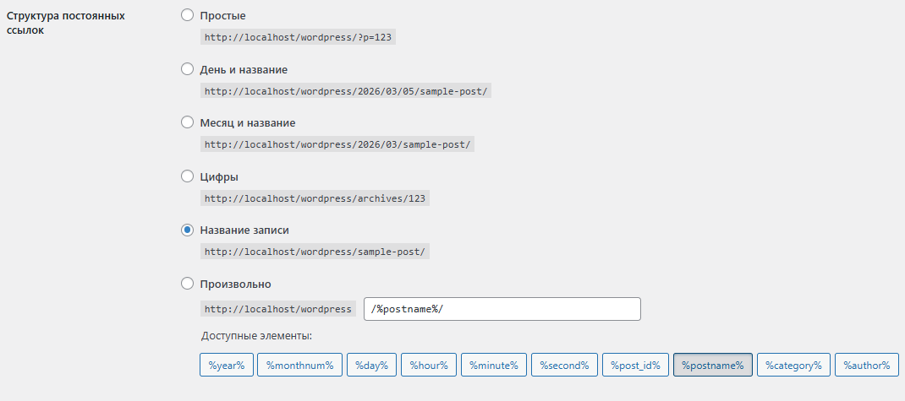

# Шаг 4. Работа с темами

Для изменения внешнего вида сайта была установлена новая тема.

Были выполнены следующие действия:

1. Открыт раздел

```
Appearance → Themes
```

2. Установлена тема:

```
Astra
```

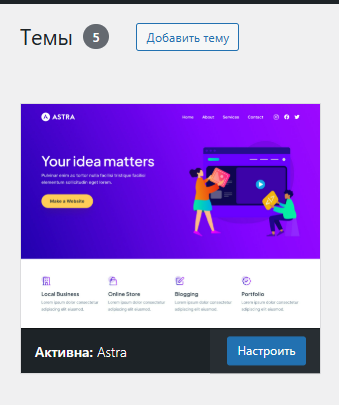

3. Тема была активирована.

После активации темы внешний вид сайта изменился.

Затем через раздел:

```
Appearance → Customize
```

были выполнены следующие настройки:

- добавлен логотип сайта
- изменена цветовая схема
- изменён заголовок сайта
- добавлено описание сайта

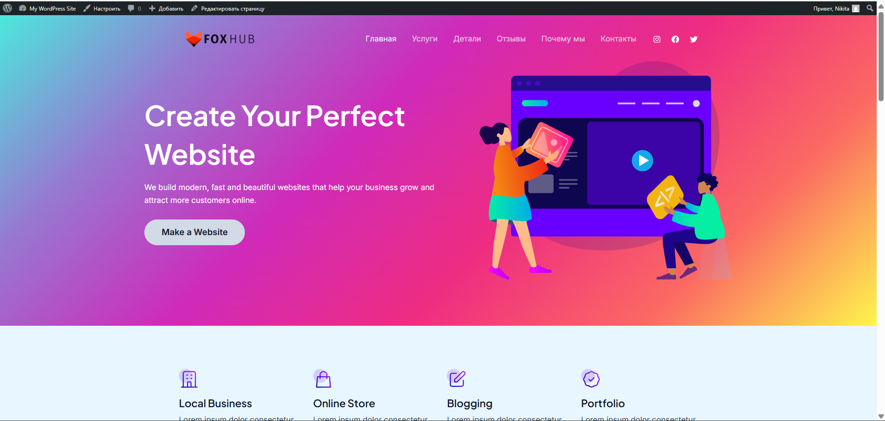

# Шаг 5. Работа с плагинами

Для расширения функциональности сайта были установлены плагины.

В разделе:

```
Plugins → Add New
```

были установлены:

### Classic Editor

Плагин, который возвращает классический редактор записей WordPress.
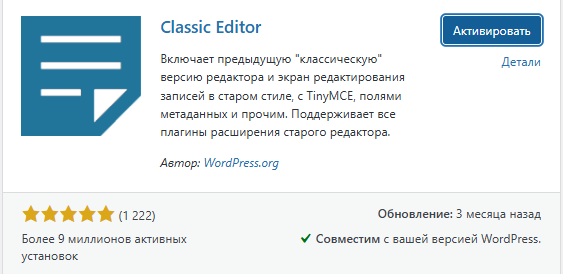

### Contact Form 7

Плагин для создания формы обратной связи.

После установки плагины были активированы.
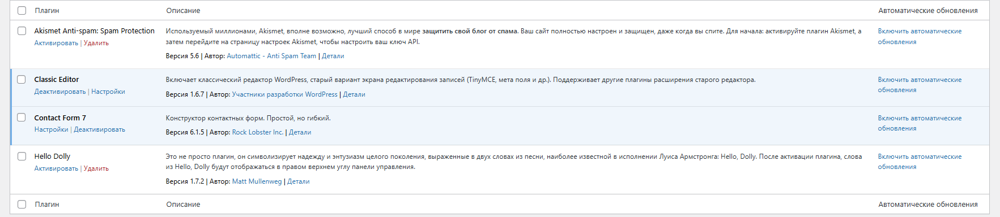

Далее была проверена их работа:

- создание записи через **Classic Editor**
  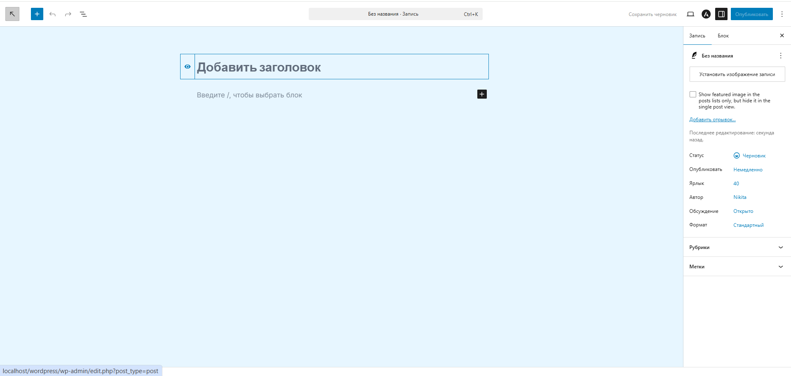
- создание формы через **Contact Form 7**
  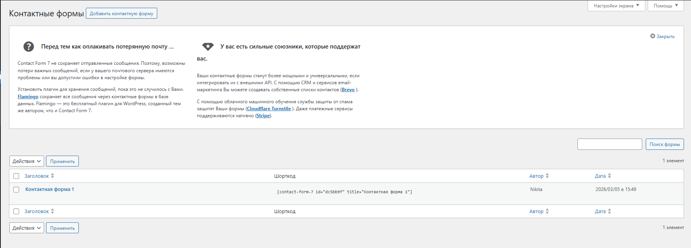

Также один из плагинов был временно отключён через раздел:

```
Plugins → Installed Plugins
```

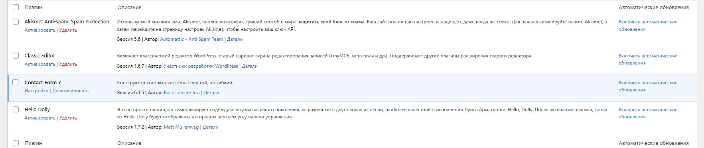
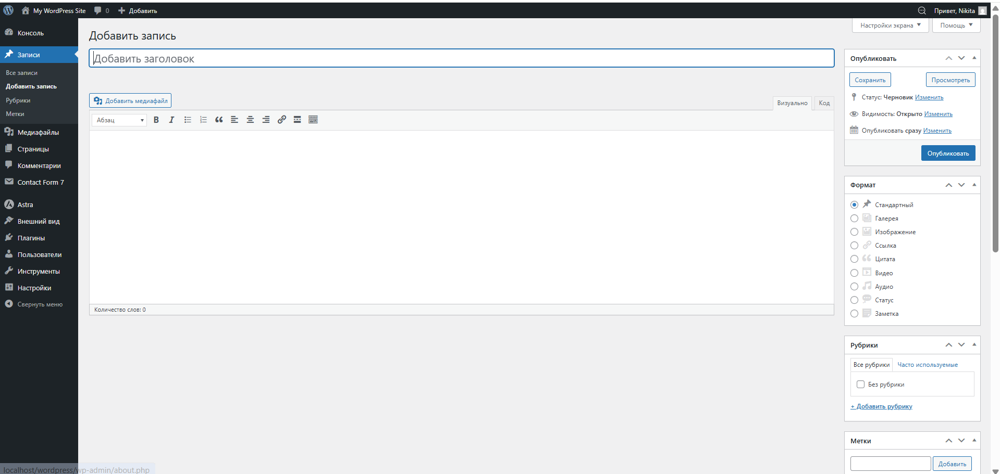

# Шаг 6. Создание контента

Для проверки работы сайта был создан контент.

## Страница «Контакты»

Была создана страница:

```
Контакты
```

На страницу была добавлена форма обратной связи с использованием плагина **Contact Form 7**.
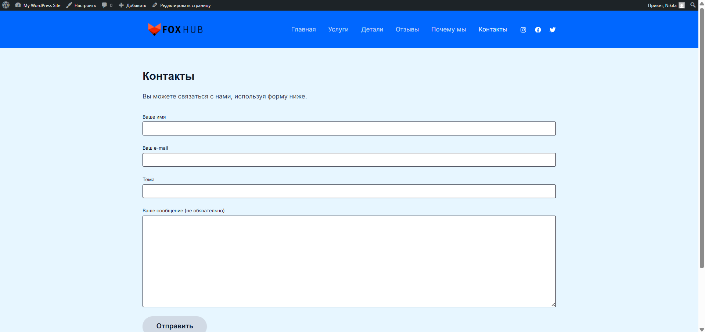

## Записи блога

Также были созданы записи блога, содержащие:

- текст
- изображения

После публикации была проверена корректность отображения контента на сайте.

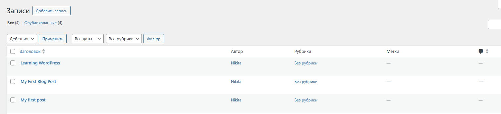

# Контрольные вопросы

## Что делает тема в WordPress, а что - плагин?

Тема отвечает за внешний вид сайта: дизайн, расположение элементов, цвета и стили.
Плагин добавляет дополнительную функциональность сайту.

## Почему при смене темы контент сайта не теряется?

Контент WordPress хранится в базе данных.
Тема влияет только на внешний вид сайта, поэтому при её смене контент остаётся неизменным.

## Как можно изменить внешний вид сайта без редактирования кода?

Внешний вид сайта можно изменить:

- через раздел **Appearance → Customize**
- установив другую тему
- изменив цвета, логотип и шрифты
- используя плагины для визуального редактирования.

# Вывод

В ходе выполнения лабораторной работы была изучена система управления контентом **WordPress**.

Были получены навыки:

- установки WordPress
- работы с административной панелью
- настройки тем
- установки и управления плагинами
- создания страниц и записей
