# Лабораторная работа №4. Разработка плагина для WordPress

## Цель работы

Освоить расширяемую модель данных WordPress: создать CPT (Custom Post Type), пользовательскую таксономию, метаданные с метабоксом в админ-панели, а также реализовать виджет для отображения данных на сайте.

## Условие

Разработать учебный плагин **USM Notes**, который добавляет на сайт раздел **«Заметки»** с приоритетами и датой напоминания.

## Шаг 1. Подготовка среды

В локальной установке WordPress был открыт каталог:

```text
wp-content/plugins
```

В нём была создана директория плагина:

```text
usm-notes
```

В файле `wp-config.php` была включена отладка:

```php
define('WP_DEBUG', true);
```

### Скриншот


## Шаг 2. Создание основного файла плагина

В папке `usm-notes` был создан файл:

```text
usm-notes.php
```

В файл были добавлены метаданные плагина: название, описание, версия и автор.

После этого плагин был активирован в административной панели WordPress. Проверено, что плагин активен и ошибок нет.

### Скриншот

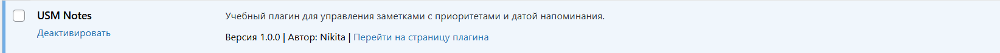

## Шаг 3. Регистрация Custom Post Type (CPT)

С помощью функции `register_post_type()` был зарегистрирован пользовательский тип записей **Notes**.

Для CPT были установлены параметры:

- `public`
- поддержка заголовка
- поддержка редактора
- поддержка автора
- поддержка миниатюры
- архивная страница
- иконка в админке
- labels

Регистрация CPT выполнена через хук `init`.

После этого в меню WordPress появился раздел **Notes**.

### Скриншот

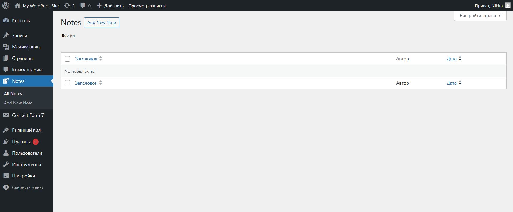

### Скриншот

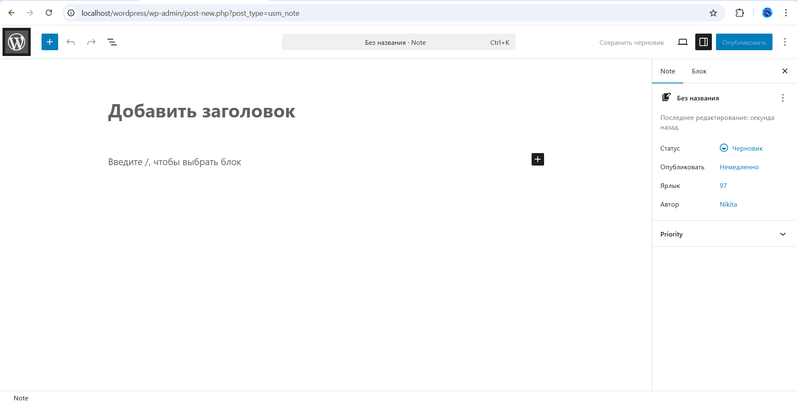

## Шаг 4. Регистрация пользовательской таксономии

С помощью функции `register_taxonomy()` была зарегистрирована таксономия **Priority**.

Таксономия была связана с CPT **Notes** и получила параметры:

- иерархическая
- публичная
- labels

Регистрация таксономии выполнена через хук `init`.

Для проверки были созданы значения:

- High
- Medium
- Low

### Меню

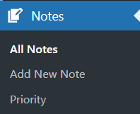

### Добавление приоритетов

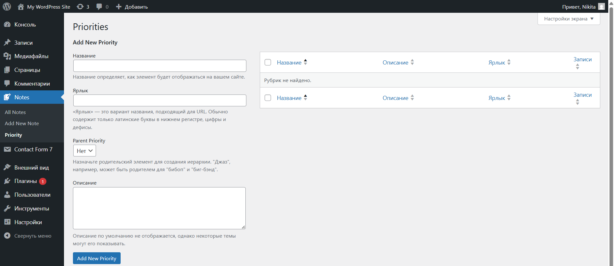

### Добавленные приоритеты

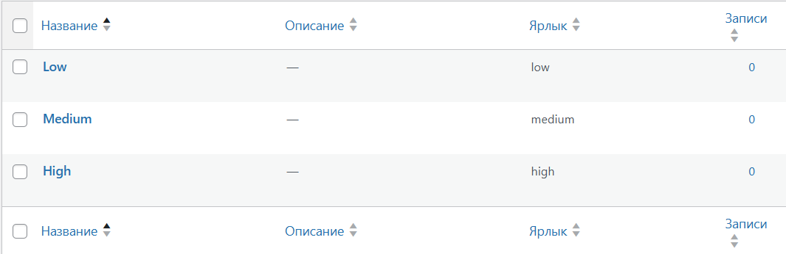

## Шаг 5. Добавление метабокса для даты напоминания

В редакторе записей типа **Notes** был добавлен метабокс **Due Date** с помощью `add_meta_box()`.

Внутри метабокса размещено поле выбора даты:

```html
<input type="date" />
```

Была создана функция сохранения значения даты с помощью хука `save_post`.

Реализовано:

- сохранение даты
- отображение даты при редактировании записи
- проверка nonce
- обязательность поля
- валидация даты
- вывод ошибки при некорректной дате
- отображение даты в списке записей CPT в админке

### Указываю дату

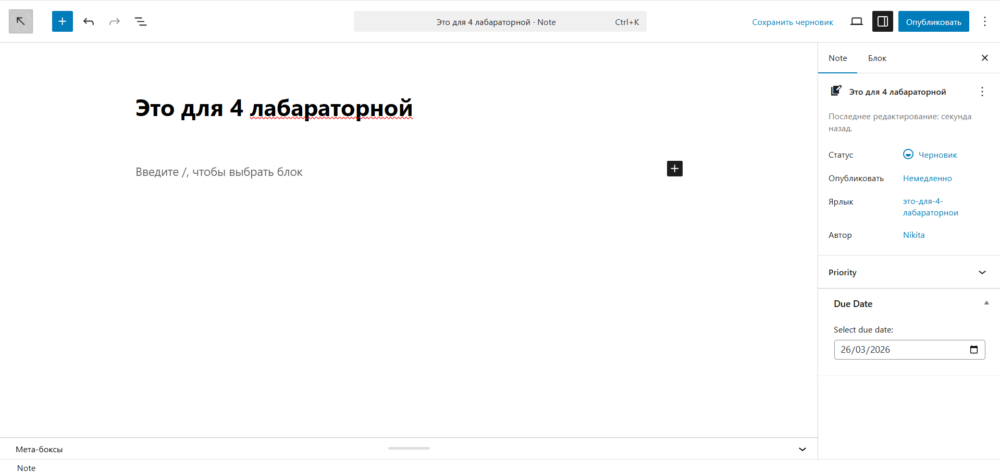

### То как оно сохранилось

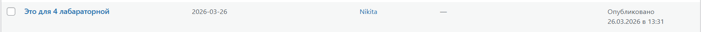

## Шаг 6. Создание шорткода для отображения заметок

Был создан шорткод:

```text
[usm_notes priority="X" before_date="YYYY-MM-DD"]
```

Функция шорткода получает и отображает список заметок в зависимости от переданных параметров.

Реализовано:

- фильтрация по приоритету
- фильтрация по дате напоминания
- вывод всех заметок, если параметры не указаны
- сообщение
  `Нет заметок с заданными параметрами`, если записи не найдены
- стили для оформления списка заметок

Шорткод зарегистрирован с помощью `add_shortcode()`.

### Скриншот

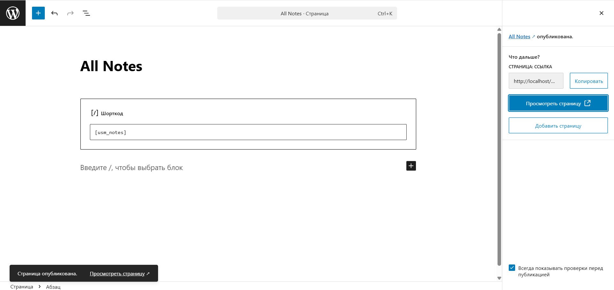

### Скриншот

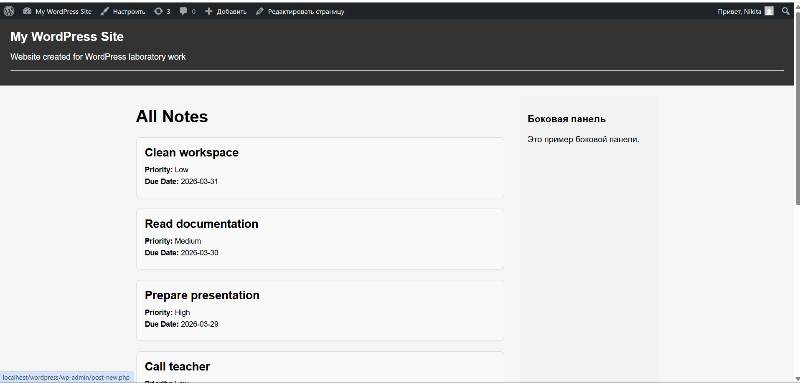

## Шаг 7. Тестирование плагина

Для тестирования было создано 5–6 заметок с разными приоритетами и датами напоминания.

Каждой заметке был назначен один из приоритетов:

- High
- Medium
- Low

Также было заполнено поле **Due Date**.

Была создана страница **All Notes**, в которую были вставлены шорткоды:

```text
[usm_notes]
[usm_notes priority="high"]
[usm_notes before_date="2025-04-30"]
```

В ходе тестирования было проверено:

- создание заметок
- выбор приоритета
- сохранение даты
- отображение даты при редактировании
- вывод даты в списке записей
- работа шорткода без параметров
- работа шорткода с фильтром по приоритету
- работа шорткода с фильтром по дате

### для отображения всех заметок


### для отображения заметок с высоким приоритетом

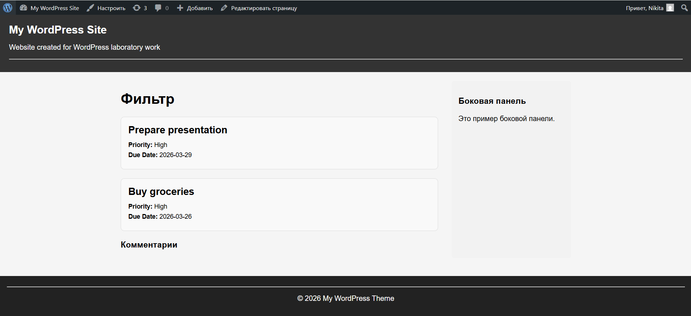

### для отображения заметок с датой напоминания до 30 апреля 2025 года

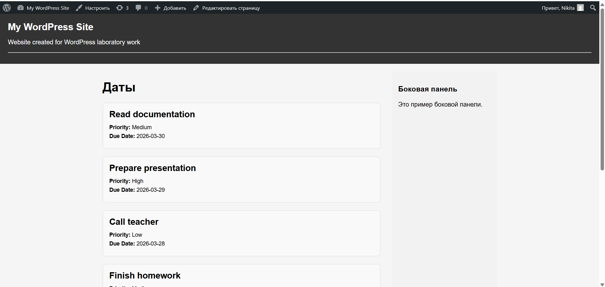

### Шорткод

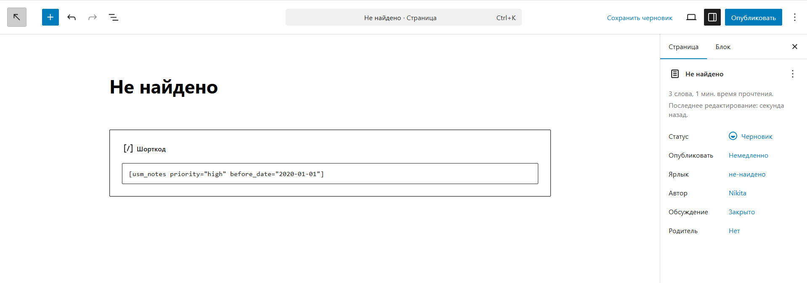

### Когда записей не найдено

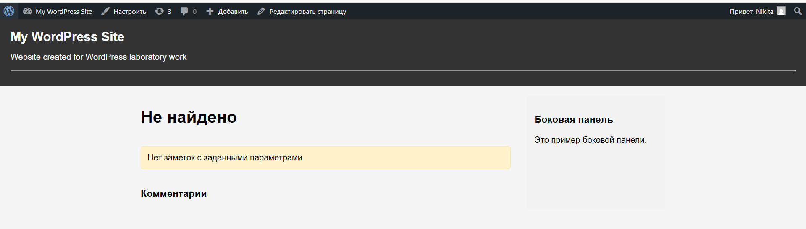

## Ответы на контрольные вопросы

### 1. Чем пользовательская таксономия отличается от метаполя?

Пользовательская таксономия используется для группировки и классификации записей.
Пример: `High`, `Medium`, `Low`.

Метаполе используется для хранения дополнительного свойства конкретной записи.
Пример: дата напоминания.

Таксономию выбирают, когда значения повторяются у многих записей.
Метаданные выбирают, когда значение индивидуально для одной записи.

### 2. Зачем нужен nonce при сохранении метаполей?

`Nonce` нужен для защиты формы от поддельных запросов.

Если его не проверять, можно принять внешний POST-запрос, и данные записи могут быть изменены без безопасной проверки источника запроса.

### 3. Какие аргументы `register_post_type()` и `register_taxonomy()` важны для фронтенда и UX?

#### Для `register_post_type()`:

- `public` - делает тип записей доступным;
- `supports` - определяет доступные поля редактора;
- `has_archive` - включает архивную страницу;
- `labels` - делает интерфейс понятным;
- `menu_icon` - улучшает навигацию в админке.

#### Для `register_taxonomy()`:

- `hierarchical` - делает таксономию похожей на категории;
- `public` - позволяет использовать её на сайте;
- `labels` - упрощает работу в админке;
- `show_admin_column` - показывает значения в таблице записей.

## Вывод

В ходе лабораторной работы был разработан плагин **USM Notes** для WordPress.

Были выполнены все этапы задания:

- создан CPT;
- создана пользовательская таксономия;
- добавлен метабокс;
- реализовано сохранение метаданных;
- добавлена проверка nonce;
- реализована валидация даты;
- создан шорткод для вывода заметок;
- выполнено тестирование.

## Использованные источники

1. [Документация WordPress](https://ru.wordpress.org/plugins/)
2. [WordPress Plugin Handbook](https://developer.wordpress.org/plugins/)
3. [Git plugin] https://github.com/WordPress/developer-plugins-handbook
