# Лабораторная работа №5. Безопасность WordPress

## Цель работы

Закрепить ключевые практики безопасности WordPress: управление ролями и паролями, обновления, базовое hardening (wp-config.php, права, отключение редактора), резервное копирование, мониторинг активности и поэтапная настройка All In One WP Security & Firewall (AIOS) для защиты от брутфорса, базового WAF и контроля прав.

### Шаг 1. Подготовка среды

Была открыта административная панель WordPress локального сайта. Проверено наличие прав администратора.
**Адиминистративная панель WordPress**
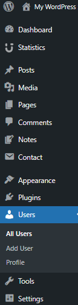

В конфигурационном файле `wp-config.php` был включён режим отладки:

```php
define('WP_DEBUG', true);
```

### Шаг 2. Управление ролями и паролями

На данном этапе был создан тестовый пользователь с ролью Автор (Author). Эта роль была выбрана для последующей проверки механизма защиты входа в систему, так как она имеет ограниченные права и не предоставляет полного административного доступа.

Создание тестовой учетной записи позволяет безопасно проверять механизмы авторизации, блокировки и защиты от brute force-атак, не затрагивая основную учетную запись администратора.

Также была выполнена проверка паролей пользователей. Особое внимание уделялось тому, чтобы для административных аккаунтов использовались сложные и устойчивые к подбору пароли. Надёжный пароль должен содержать:

-буквы верхнего и нижнего регистра;
-цифры;
-специальные символы;
-достаточную длину.

**Создание текстового пользователя**
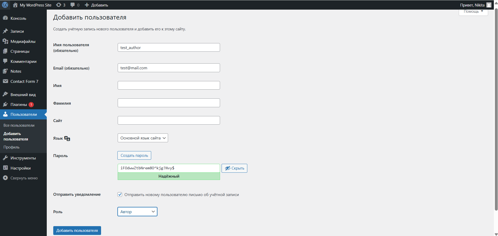
**Проверка пользователей и ролей**
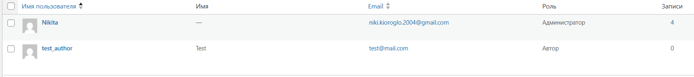

### Шаг 3. Обновления ядра, тем и плагинов

На третьем этапе была проведена проверка актуальности установленной версии WordPress, а также обновлений для активной темы и установленных плагинов.

Сначала был открыт раздел обновлений в панели администратора, где выполняется централизованная проверка доступных обновлений. В ходе проверки было установлено, что ядро WordPress уже обновлено до актуальной версии. После этого были обновлены темы и плагины, для которых были доступны новые версии.

**Раздел обновления Wordpress**
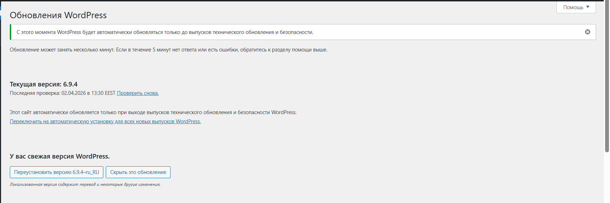
**Обновление плагинов**
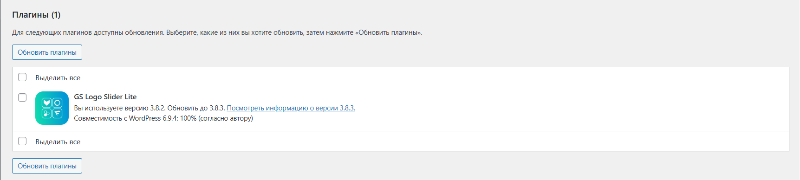
**Обновление тем**
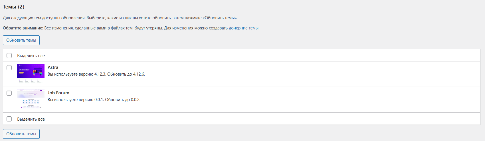

### Шаг 4. Базовое hardening

Для повышения безопасности были выполнены следующие действия:

- отключено редактирование файлов из админки:

```php
define('DISALLOW_FILE_EDIT', true);
```

- изучены рекомендуемые права доступа:
  - папки: 755
  - файлы: 644
    Эти значения считаются безопасными, так как ограничивают возможность несанкционированной записи и изменения файлов. Следует отметить, что в данной работе сайт запускался в локальной среде XAMPP на Windows, поэтому классическая модель Linux-прав (chmod) напрямую не применялась. Однако сами рекомендуемые значения были изучены как часть теоретической и практической подготовки.

- добавлена защита `wp-config.php` через `.htaccess`:

```apache
<files wp-config.php>
    order allow,deny
    deny from all
</files>
```

Включение режима отладки полезно на этапе разработки и тестирования, однако на рабочем сайте данную настройку обычно отключают, чтобы не раскрывать внутреннюю информацию о системе.

### Шаг 5. Установка и первичная настройка All In One WP Security & Firewall (AIOS)

Использован плагин All In One WP Security & Firewall.
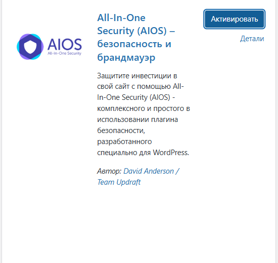

## User Login (Login Lockdown)

Активирована функция Login Lockdown со следующими параметрами:

- Max Login Attempts: 5
- Login Retry Time Period: 15 минут
- Minimum Lockout Time: 30 минут

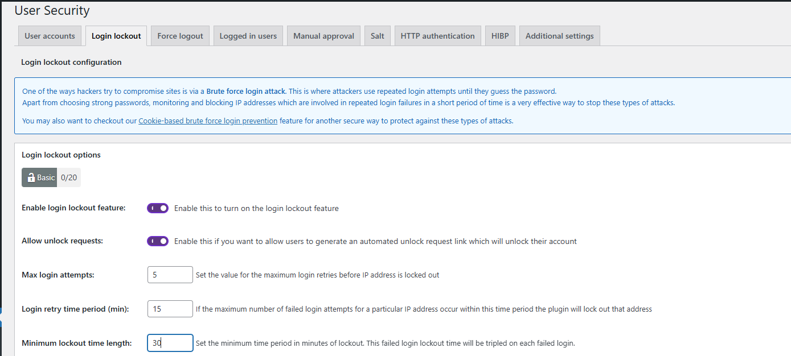

## User Accounts

В разделе User Accounts была выполнена проверка списка пользователей. Особое внимание уделялось наличию стандартного логина admin, так как он часто используется злоумышленниками в автоматизированных атаках как первый вариант имени пользователя.

В ходе проверки было подтверждено, что пользователь с логином admin отсутствует. Это уменьшает вероятность успешного подбора пары логин/пароль при массовых атаках.

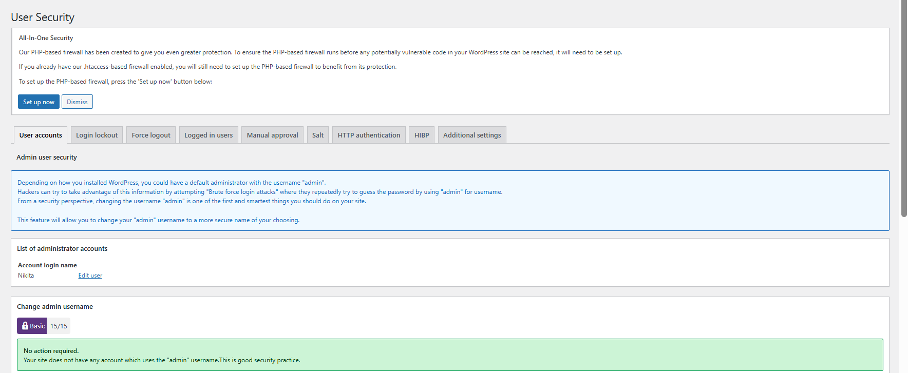

## User Registration

Далее была проверена настройка регистрации новых пользователей в WordPress через раздел Settings → General. Было установлено, что функция свободной регистрации отключена.

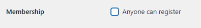

## Filesystem Security

В разделе File Security была выполнена проверка прав доступа к файлам и папкам. Плагин определил, что сайт размещён на локальной Windows-среде (XAMPP), поэтому стандартная проверка прав доступа в формате Linux не применяется.

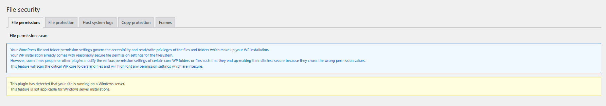

## Firewall

Активирован базовый брандмауэр.

Включены:

- защита от XSS
- фильтрация вредоносных запросов
- отключение directory browsing

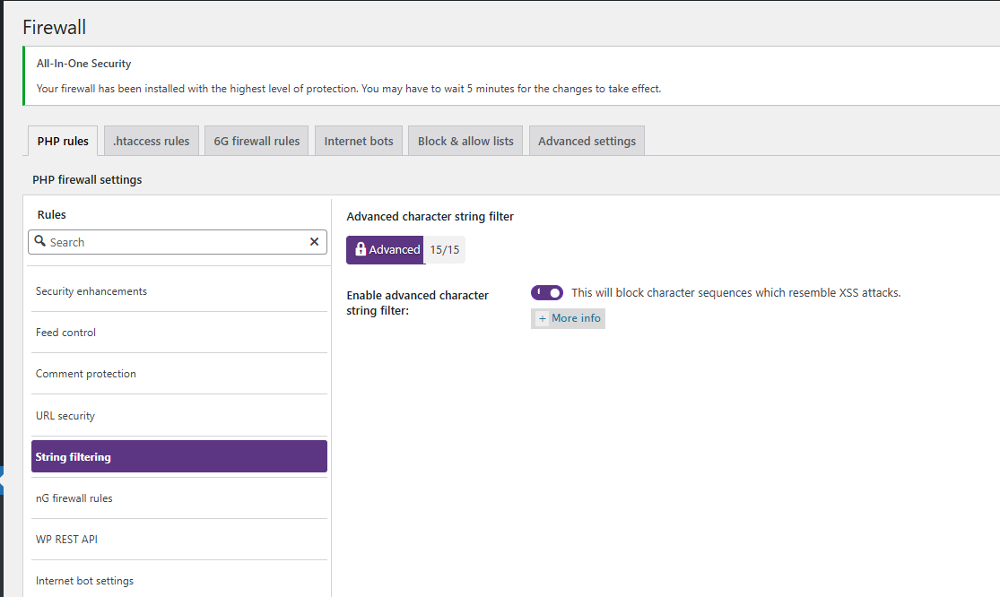
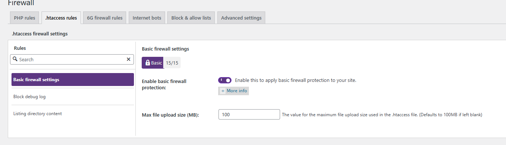
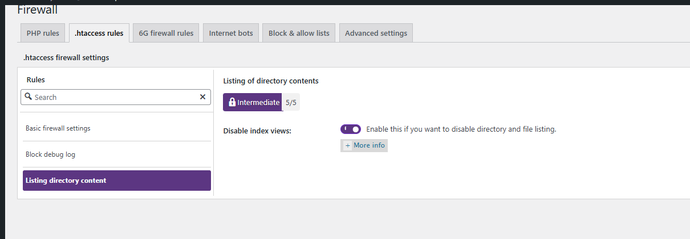

## Brute Force

В разделе Brute Force была активирована функция Rename Login Page. Стандартный адрес страницы входа /wp-login.php был изменён на нестандартный URL:

```text
/login-secure
```

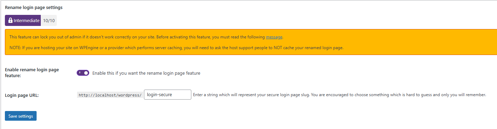

## Scanner / Notifications

В разделе Scanner была включена функция отслеживания изменений файлов. Этот механизм позволяет фиксировать изменения в файловой системе сайта и уведомлять администратора, если были изменены важные файлы WordPress, темы или плагины.

Также были настроены email-уведомления. Благодаря этому администратор сможет оперативно узнать о подозрительных изменениях и вовремя принять меры.

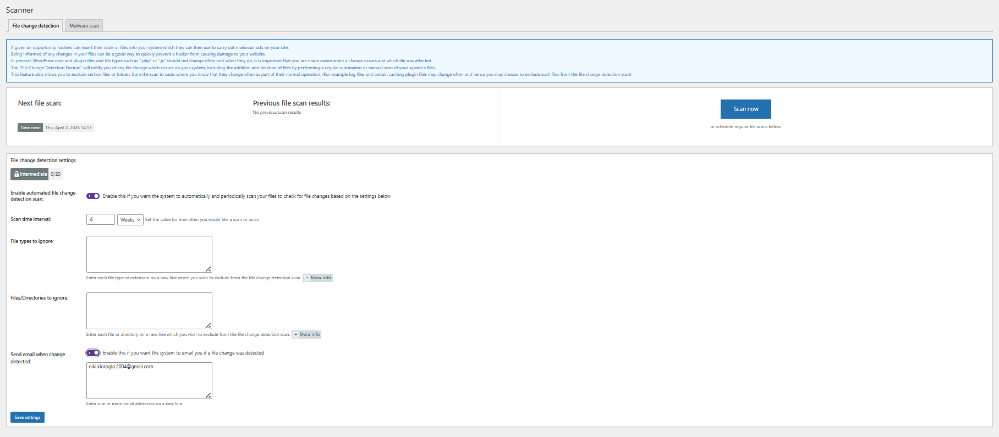

## Backup

Создана резервная копия базы данных (.sql).

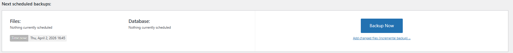

# Шаг 6. Проверка защиты

Выполнены многократные попытки входа с неправильным паролем.

После превышения лимита система заблокировала IP-адрес.

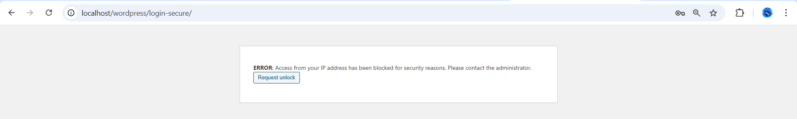

# Шаг 7. Восстановление

На заключительном этапе была проверена возможность восстановления данных из ранее созданной резервной копии.

Сначала была удалена тестовая запись и одно изображение из медиатеки. После этого был открыт phpMyAdmin и выполнен импорт резервной копии базы данных. Для восстановления использовался ранее скачанный файл резервной копии базы, представленный в сжатом формате .gz.

После завершения импорта была выполнена проверка состояния сайта. Удалённые данные были восстановлены, что подтверждает корректную работу механизма резервного копирования и восстановления.

**До восстановления**
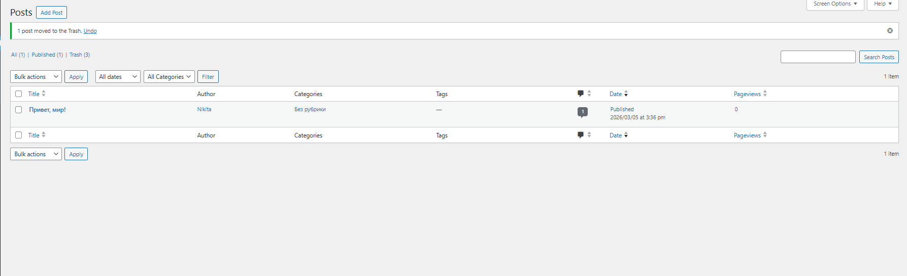
**После восстановления**
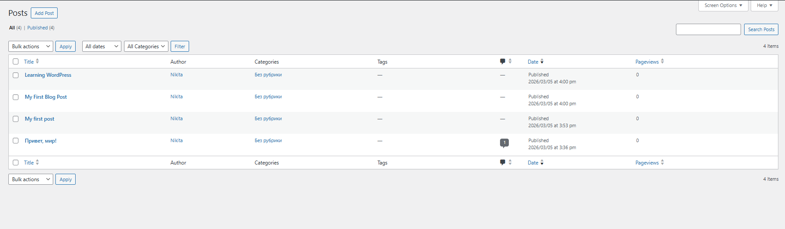

## Контрольные вопросы

### 1. Почему `DISALLOW_FILE_EDIT` и правильные права на `wp-config.php` уменьшают риск пост-эксплойта?

`DISALLOW_FILE_EDIT` запрещает редактирование файлов через админку WordPress. Это мешает злоумышленнику быстро вставить вредоносный код после получения доступа к аккаунту администратора.

Файл `wp-config.php` содержит важные данные: настройки сайта и подключение к базе данных. Если доступ к нему ограничен правильно, риск кражи или изменения конфигурации значительно снижается.

### 2. Какие параметры Login Lockdown/Firewall были выбраны и почему?

Для Login Lockdown были выбраны:

- 5 попыток входа;
- 15 минут периода попыток;
- 30 минут блокировки.

Такие настройки дают баланс между безопасностью и удобством: они ограничивают brute force-атаки, но не слишком мешают обычному пользователю.

Для Firewall был включён базовый уровень защиты, а также фильтрация вредоносных строк, XSS-защита и отключение просмотра директорий. Эти меры повышают безопасность сайта без сильного риска поломки функциональности.

### 3. Чем отличаются меры защиты WordPress от мер на уровне сервера и ОС?

Защита на уровне WordPress работает внутри самой CMS: это плагины, защита входа, мониторинг файлов, firewall на уровне приложения.

Защита на уровне сервера и ОС работает ниже: это права доступа к файлам, настройки Apache/Nginx, PHP, базы данных и системный firewall.

Иными словами, WordPress-защита отвечает за безопасность сайта как приложения, а серверная защита — за безопасность всей среды, где он работает.

### 4. Что должно входить в полный бэкап WordPress?

Полный бэкап должен включать:

- базу данных;
- папку `wp-content` (темы, плагины, загрузки);
- при необходимости `wp-config.php` и `.htaccess`.

Проверка бэкапа выполняется через тестовое восстановление. В данной работе после удаления данных был выполнен импорт резервной копии, и удалённые элементы были успешно восстановлены.

# Вывод

В ходе работы были настроены основные механизмы защиты WordPress. Реализована защита от brute force атак, выполнено резервное копирование и проверка восстановления данных. Уровень безопасности сайта значительно повышен.
